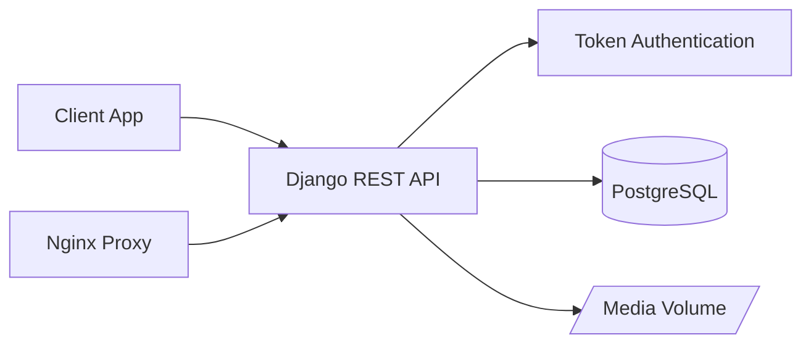

# Recipe API

<p align="center">
	<strong>Production-style Recipe Management API</strong><br />
	Django REST Framework, PostgreSQL, Token Auth, Docker, OpenAPI
</p>

<p align="center">
	<a href="#quick-start">Quick Start</a> •
	<a href="#api-at-a-glance">API</a> •
	<a href="#architecture">Architecture</a> •
	<a href="#troubleshooting">Troubleshooting</a>
</p>

<p align="center">
	
	
	
	
	
</p>

---

## Why This Project

Recipe API is a backend service for building meal-planning and cooking apps with strong API fundamentals:

- isolated user data
- predictable REST endpoints
- clean authentication flow
- schema-driven documentation
- container-first developer experience

---

## Highlights

| Capability | What You Get |
|---|---|
| Authentication | Register users, issue auth tokens, manage current profile |
| Recipes | Full CRUD with ownership isolation |
| Tags & Ingredients | Reusable user-scoped attributes with filtering |
| Media | Recipe image upload endpoint (multipart) |
| Documentation | Swagger UI + OpenAPI schema |
| Ops | Health check endpoint and DB readiness command |
| DevEx | Dockerized local and deploy workflows |

---

## Quick Start

### Prerequisites

- Docker
- Docker Compose

### Run Development Stack

```bash
docker-compose up --build
```

Open:
- API root: http://127.0.0.1:8000
- Swagger docs: http://127.0.0.1:8000/api/docs/
- OpenAPI schema: http://127.0.0.1:8000/api/schema/

### Common Commands

```bash
# run all tests
docker-compose run --rm app sh -c "python manage.py test"

# run a focused test module
docker-compose run --rm app sh -c "python manage.py test core.tests.test_health_check"

# lint
docker-compose run --rm app sh -c "flake8"

# create admin user
docker-compose run --rm app sh -c "python manage.py createsuperuser"
```

---

## API At A Glance

### Public Endpoints

| Method | Endpoint | Purpose |
|---|---|---|
| GET | /api/health-check/ | Service health probe |
| GET | /api/schema/ | OpenAPI schema |
| GET | /api/docs/ | Swagger UI |
| POST | /api/user/create/ | Register a new user |
| POST | /api/user/token/ | Obtain auth token |

### Authenticated Endpoints

| Method | Endpoint | Purpose |
|---|---|---|
| GET, PATCH | /api/user/me/ | Retrieve/update current user |
| GET, POST | /api/recipe/ | List/create recipes |
| GET, PATCH, PUT, DELETE | /api/recipe/{id}/ | Manage one recipe |
| POST | /api/recipe/{id}/upload-image/ | Upload recipe image |
| GET, POST | /api/recipe/tags/ | List/create tags |
| PATCH, DELETE | /api/recipe/tags/{id}/ | Update/delete tag |
| GET, POST | /api/recipe/ingredients/ | List/create ingredients |
| PATCH, DELETE | /api/recipe/ingredients/{id}/ | Update/delete ingredient |

### Query Filters

| Endpoint | Query | Example |
|---|---|---|
| /api/recipe/ | tags | /api/recipe/?tags=1,2 |
| /api/recipe/ | ingredients | /api/recipe/?ingredients=3,4 |
| /api/recipe/tags/ | assigned_only | /api/recipe/tags/?assigned_only=1 |
| /api/recipe/ingredients/ | assigned_only | /api/recipe/ingredients/?assigned_only=1 |

---

## Beautiful Request Examples

### 1) Create User

```http
POST /api/user/create/
Content-Type: application/json
```

```json
{
	"email": "chef@example.com",
	"password": "strongpass123",
	"name": "Chef User"
}
```

### 2) Get Token

```http
POST /api/user/token/
Content-Type: application/json
```

```json
{
	"email": "chef@example.com",
	"password": "strongpass123"
}
```

```json
{
	"token": "<token-value>"
}
```

### 3) Create Recipe With Tags and Ingredients

```http
POST /api/recipe/
Authorization: Token <your-token>
Content-Type: application/json
```

```json
{
	"title": "Lemon Pasta",
	"time_minutes": 20,
	"price": "7.50",
	"description": "Quick weekday dinner",
	"link": "https://example.com/lemon-pasta",
	"tags": [
		{"name": "Dinner"},
		{"name": "Italian"}
	],
	"ingredients": [
		{"name": "Lemon"},
		{"name": "Pasta"}
	]
}
```

### 4) Upload Recipe Image

```bash
curl -X POST "http://127.0.0.1:8000/api/recipe/1/upload-image/" \
	-H "Authorization: Token <your-token>" \
	-F "image=@/path/to/photo.jpg"
```

---

## Authentication Flow

1. Register at /api/user/create/
2. Login at /api/user/token/
3. Use token in every protected request

```http
Authorization: Token <your-token>
```

---

## Architecture



### App Modules

| Module | Responsibility |
|---|---|
| app/core | Data models, admin, health check, management commands |
| app/user | User registration, token issue, profile management |
| app/recipe | Recipe, tag, ingredient viewsets + serializers |
| proxy | Nginx deploy config |
| scripts/run.sh | Entrypoint: wait_for_db, collectstatic, migrate, uWSGI |

---

## Tech Stack

| Layer | Tooling |
|---|---|
| Language | Python 3.9 |
| Framework | Django 3.2 |
| API | Django REST Framework 3.12 |
| Docs | drf-spectacular |
| Database | PostgreSQL 13 |
| Media | Pillow |
| App Server | uWSGI |
| Reverse Proxy | Nginx |
| Containers | Docker + Compose |
| Linting | flake8 |

---

## Repository Layout

```text
.
|- app/
|  |- app/
|  |- core/
|  |- recipe/
|  |- user/
|  |- manage.py
|- proxy/
|- scripts/run.sh
|- docker-compose.yml
|- docker-compose-deploy.yml
|- Dockerfile
|- requirements.txt
|- requirements.dev.txt
```

---

## Local Run Without Docker

Use this only if PostgreSQL is already running locally.

### Windows PowerShell

```powershell
cd app
python -m venv .venv
.venv\Scripts\Activate.ps1
pip install --upgrade pip
pip install -r ..\requirements.txt -r ..\requirements.dev.txt

$env:DB_HOST = "127.0.0.1"
$env:DB_NAME = "devdb"
$env:DB_USER = "devuser"
$env:DB_PASS = "changeme"
$env:DEBUG = "1"

python manage.py migrate
python manage.py runserver 0.0.0.0:8000
```

### Linux/macOS

```bash
cd app
python -m venv .venv
source .venv/bin/activate
pip install --upgrade pip
pip install -r ../requirements.txt -r ../requirements.dev.txt

export DB_HOST=127.0.0.1
export DB_NAME=devdb
export DB_USER=devuser
export DB_PASS=changeme
export DEBUG=1

python manage.py migrate
python manage.py runserver 0.0.0.0:8000
```

---

## Environment Variables

### Development Defaults

| Variable | Value |
|---|---|
| DB_HOST | db |
| DB_NAME | devdb |
| DB_USER | devuser |
| DB_PASS | changeme |
| DEBUG | 1 |

### Deploy Variables

| Variable | Required | Description |
|---|---|---|
| DB_HOST | Yes | PostgreSQL host |
| DB_NAME | Yes | Database name |
| DB_USER | Yes | Database user |
| DB_PASS | Yes | Database password |
| DJANGO_SECRET_KEY | Yes | Django secret key |
| DJANGO_ALLOWED_HOSTS | Yes | Comma-separated allowed hosts |

Production recommendations:
- set DEBUG=0
- use strong random secrets
- inject secrets via environment manager

---

## Data Model Snapshot

| Model | Key Fields |
|---|---|
| User | email (unique), name, password, is_active, is_staff |
| Tag | name, user, unique(name, user) |
| Ingredient | name, user, unique(name, user) |
| Recipe | title, description, time_minutes, price, link, image, user |

Relationship notes:
- Recipe has many tags
- Recipe has many ingredients
- Tag and ingredient names are unique per user

Image storage path pattern:
- /vol/web/media/uploads/recipe/<uuid>.<ext>

---

## Testing and Quality

Covered test areas include:
- user creation, token auth, profile management
- recipe CRUD and ownership isolation
- tag and ingredient CRUD
- assigned_only filtering
- recipe filtering by tag/ingredient ids
- image upload behavior
- wait_for_db command behavior
- health-check endpoint

Run checks:

```bash
docker-compose run --rm app sh -c "python manage.py test"
docker-compose run --rm app sh -c "flake8"
```

---

## Deployment Notes

Deploy compose stack:
- app (uWSGI)
- db (PostgreSQL)
- proxy (Nginx)

Container startup sequence:
1. wait for DB
2. collect static files
3. run migrations
4. launch uWSGI on :9000

Nginx serves static files and proxies dynamic requests to app.

---

## Troubleshooting

### psycopg2 or psycopg not found

If local Python tests fail with PostgreSQL adapter errors, use Docker test commands:

```bash
docker-compose run --rm app sh -c "python manage.py test"
```

Or install dependencies in your active virtual environment:

```bash
pip install -r requirements.txt -r requirements.dev.txt
```

### Database connection errors

- confirm db container is running
- verify DB_HOST/DB_NAME/DB_USER/DB_PASS
- use explicit readiness check:

```bash
python manage.py wait_for_db --max-retries 60 --wait-interval 1.5
```

### Unauthorized responses

- verify Authorization header format
- refresh token via /api/user/token/

### Image upload returns 400

- send multipart/form-data
- include image field
- use /api/recipe/{id}/upload-image/

---

## Security Best Practices

- keep secret values outside source control
- set strict allowed hosts in production
- run with DEBUG disabled in production
- terminate TLS/HTTPS before public access
- backup PostgreSQL volumes on schedule
- rotate credentials on suspected exposure

---

## Roadmap Ideas

- pagination defaults for list endpoints
- title and ingredient search
- throttling/rate limits
- CI checks for tests and lint on pull requests
- API versioning
- JWT option as additional auth strategy
- favorites and saved recipes